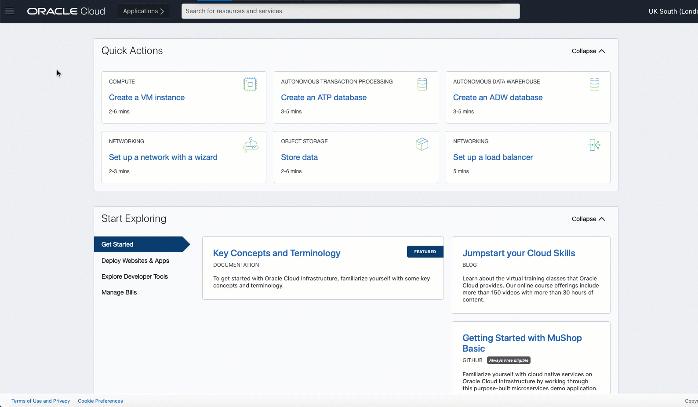
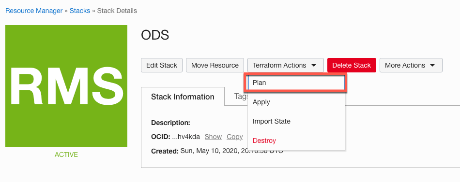
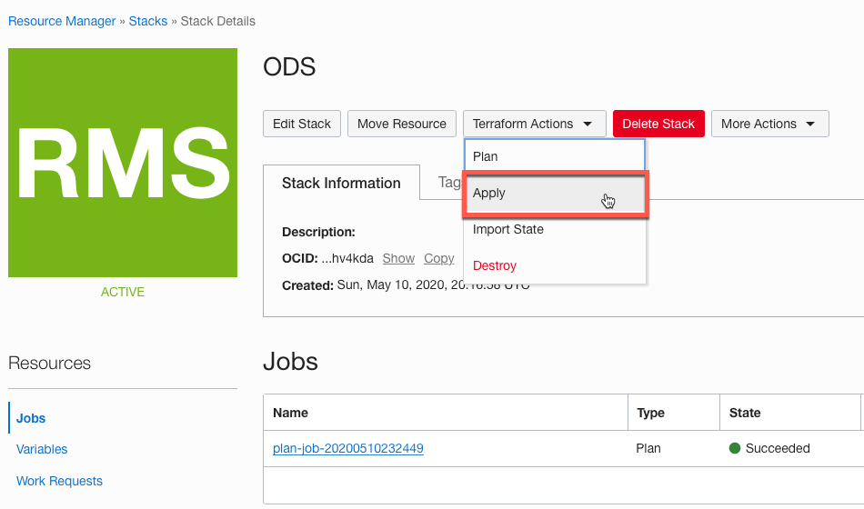
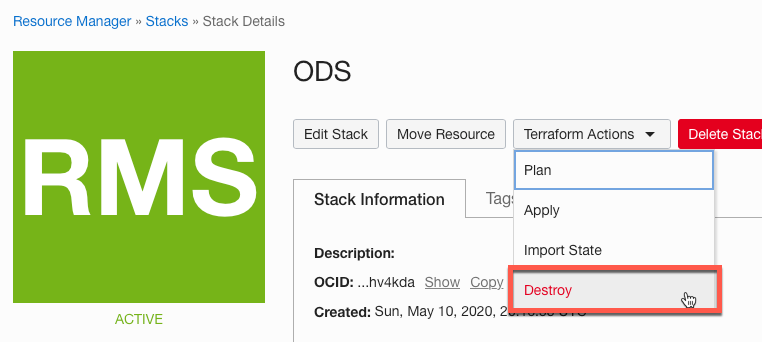
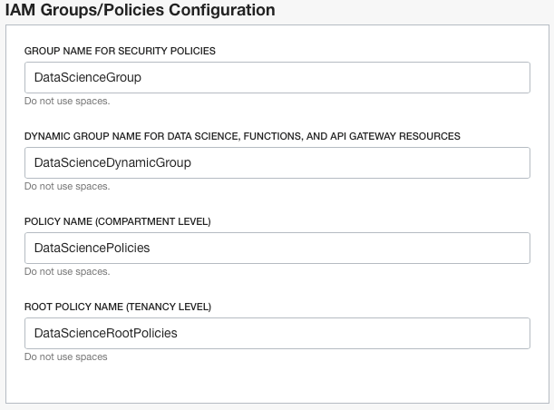
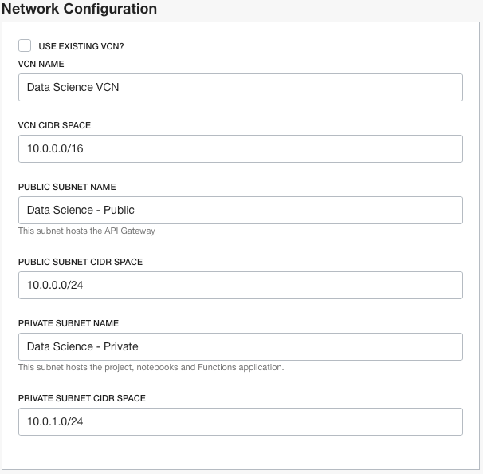
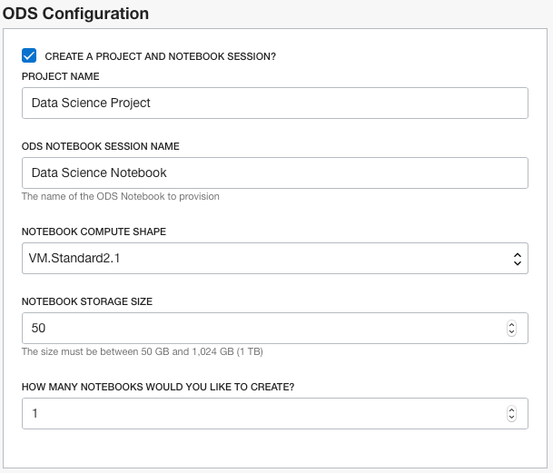
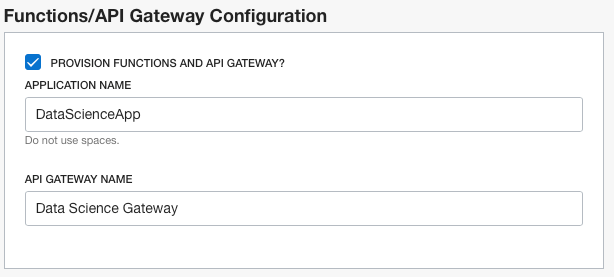

# Provision Oracle Data Science (**_ODS_**) Using OCI Resource Manager and Terraform

## Introduction

This solution allows you to provision [Oracle Data Science (**_ODS_**)](https://docs.cloud.oracle.com/en-us/iaas/data-science/using/data-science.htm) and all its related artifacts using [Terraform](https://www.terraform.io/docs/providers/oci/index.html) and [Oracle OCI Resource Manager](https://docs.cloud.oracle.com/en-us/iaas/Content/ResourceManager/Concepts/resourcemanager.htm).

Below is a list of all artifacts that will be provisioned:

| Component    | Description                         | Default Name            | Optional | Enabled By Default | Number of Items Provisioned | Notes
|--------------|-------------------------------------|-------------------------|----------|--------------------|-----------------------------|-----------|
| [ODS Project](https://docs.cloud.oracle.com/en-us/iaas/data-science/using/manage-projects.htm)  | Oracle OCI Data Science Project     | Data Science Project    | True     | True               | 1                           | -
| [ODS Notebook](https://docs.cloud.oracle.com/en-us/iaas/data-science/using/manage-notebook-sessions.htm) | Oracle OCI Data Science Notebook(s) | Data Science Notebook-x | True     | True               | 1  or more                  | You can provision more than one notebook, and each notebook will be prefixed with an index (x) starting from (0) 
| [Functions](https://docs.cloud.oracle.com/en-us/iaas/Content/Functions/Concepts/functionsconcepts.htm)    | Oracle OCI Function Application     | DataScienceApp          | True     | False              | 1                           | Only OCI **Functions Application** will be provisioned without a **Function deployment**. This is a placeholder application so you can deploy your model application later on.
| [API Gateway](https://docs.cloud.oracle.com/en-us/iaas/Content/APIGateway/Concepts/apigatewayconcepts.htm)  | Oracle OCI API Gateway              | Data Science Gateway    | True     | False              | 1                           | Only OCI **API Gateway** will be provisioned without an **API Gateway deployment**. The gateway is used to expose the OCI Function through a REST interface.
| [VCN](https://docs.cloud.oracle.com/en-us/iaas/Content/Network/Tasks/managingVCNs.htm#VCNsandSubnets)          | Oracle OCI VCN                      | Data Science VCN        | True     | True               | 1                           | OCI VCN and all its related artifacts (Subnets, Security Lists, Routing Tables, Internet Gateway, Nat Gateway).
| [Subnets](https://docs.cloud.oracle.com/en-us/iaas/Content/Network/Tasks/managingVCNs.htm#VCNsandSubnets)      | Oracle OCI VCN Subnets              | Data Science - Public/Private | True | True             | 2                           | One **Public Subnet** with its Security List and Routing Table and configured with an Internet Gateway (Hosts API Gateway). One **Private Subnet** and its Security List and Routing Table and configured with a NAT Gateway and hosts (ODS Project, ODS Notebooks, Function)
| [Group](https://docs.cloud.oracle.com/en-us/iaas/Content/Identity/Tasks/managinggroups.htm)        | Oracle OCI Users Group              | DataScienceGroup        | False    | True               | 1                           | All Policies are granted to this group, you can add users to this group to grant me access to ODS services.
| [Dynamic Group](https://docs.cloud.oracle.com/en-us/iaas/Content/Identity/Tasks/managingdynamicgroups.htm) | Oracle OCI Dynamic Group           | DataScienceDynamicGroup | False    | True               | 1                           | Dynamic Group for Functions and API Gateway.
| [Policies (compartment)](https://docs.cloud.oracle.com/en-us/iaas/Content/Identity/Concepts/policygetstarted.htm)   | Oracle OCI Security Policies        | DataSciencePolicies    | False              | True   | 1                  | A policy at the compartment level to grant access to ODS, VCN, Functions and API Gateway
| [Policies (root)](https://docs.cloud.oracle.com/en-us/iaas/Content/Identity/Concepts/policygetstarted.htm)    | Oracle OCI Security Policies        | DataScienceRootPolicies      | False              | True    | 1                 | A policy at the root compartment level to grant access to OCIR in tenancy. 

## Prerequisite

- You need a user with an **Administrator** privileges to execute the ORM stack or Terraform scripts.
- Make sure your tenancy has service limits availabilities for the above components in the table.

## Using Oracle Resource Manager (ORM)

1. clone repo `git clone git@github.com:oracle-quickstart/oci-ods-orm.git`
1. Download [`oci-ods-orm-v1.0.0.zip`](../../releases/download/v1.0.0/oci-ods-orm-v1.0.0.zip) file
1. From OCI **Console/Resource Manager**, create a new stack.
1. Make sure you select **My Configurations** and then upload the zip file downloaded in the previous step.
1. Set a name for the stack and click Next.
1. Set the required variables values and then Create.
    

1. From the stack details page, Select **Plan** under **Terraform Actions** menu button and make sure it completes successfully.
    
    
1. From the stack details page, Select **Apply** under **Terraform Actions** menu button and make sure it completes successfully.
    
    
1. To destroy all created artifacts, from the stack details page, Select **Destroy** under **Terraform Actions** menu button and make sure it completes successfully.
    
    
### Understanding Provisioning Options

* **IAM Groups/Policies** change default names of Groups and Policies to be created.

    
    
* If **Use Existing VCN** is **_NOT_** selected, A new VCN will be created along with all its related artifacts (Subnets, Security Lists, Route Tables, Internet Gateway, NAT Gateway), and all artifacts will be provisioned within that VCN. **_Otherwise_** (Use Existing VCN is selected), you need to select an existing VCN and subnets, then all artifacts will provisioned within the selected VCN and Subnets.

    
    
* If **Provision ODS** is selected, ODS Project and Notebook session will be provisioned, you can change the default values if needed, otherwise no ODS artifacts will be provisioned, _**however**_ all other artifacts (Network, Policies, Function, API Gateway) will be provisioned.

    
    
* If **Provision Functions and API Gateway** is selected, a **Function** and **API Gateway** will be provisioned. You can change default values if needed. **_Note_** that no **_Function Deployment_** or **_API Gateway Deployment_** will be provisioned.

    

    
## Using Terraform

1. Clone repo 
   ```
   git clone git@github.com:oracle-quickstart/oci-ods-orm.git
   cd oci-ods-orm/terraform
   ```
1. Create a copy of the file **oci-ods-orm/terraform/terraform.tfvars.example** in the same directory and name it **terraform.tfvars**.
1. Open the newly created **oci-ods-orm/terraform/terraform.tfvars** file and edit the following sections:
    * **TF Requirements** : Add your OCI user and tenant details:
        ```
           #*************************************
           #           TF Requirements
           #*************************************
           
           // OCI Region, user "Region Identifier" as documented here https://docs.cloud.oracle.com/en-us/iaas/Content/General/Concepts/regions.htm
           region=""
           // The Compartment OCID to provision artificats within
           compartment_ocid=""
           // OCI User OCID, more details can be found at https://docs.cloud.oracle.com/en-us/iaas/Content/API/Concepts/apisigningkey.htm#five
           user_ocid=""
           // OCI tenant OCID, more details can be found at https://docs.cloud.oracle.com/en-us/iaas/Content/API/Concepts/apisigningkey.htm#five
           tenancy_ocid=""
           // Path to private key used to create OCI "API Key", more details can be found at https://docs.cloud.oracle.com/en-us/iaas/Content/General/Concepts/credentials.htm#two
           private_key_path=""
           // "API Key" fingerprint, more details can be found at https://docs.cloud.oracle.com/en-us/iaas/Content/General/Concepts/credentials.htm#two
           fingerprint=""
        ```

    * **ODS Requirements** : Check Default values for ODS artifacts and change them if needed
        ```
           #*************************************
           #           ODS Specific
           #*************************************
           // Provision ODS Project and Notebook
           enable_ods=true
           // ODS Default Project Name
           ods_project_name= "Data Science Project"
           // ODS Notebook Name
           ods_notebook_name = "Data Science Notebook"
           // Default Compute shape to use for a Notebook. Supported VM Shapes:
           //    - VM.Standard.E2.2
           //    - VM.Standard.E2.4
           //    - VM.Standard.E2.8
           //    - VM.Standard2.1
           //    - VM.Standard2.2
           //    - VM.Standard2.4
           //    - VM.Standard2.8
           //    - VM.Standard2.16
           //    - VM.Standard2.24
           // VM Shapes Specs details can be found at https://docs.cloud.oracle.com/en-us/iaas/Content/Compute/References/computeshapes.htm#virtualmachines
           ods_compute_shape="VM.Standard2.1"
           // Notebook sotrage size in GB, minimum is 50 and maximum is 1024 (1TB)
           ods_storage_size="50"
           // Number of Notebooks to provision, default is 1.
           ods_number_of_notebooks=1
        ``` 
    * **Network Requirements**: Check default values for Network artifacts and change them if needed
        ```
            #*************************************
            #         Network Specific
            #*************************************
            
            // Use an existing VCN or create a new VCN along with all its related artifacts 
            ods_vcn_use_existing = false
            
            // VCN Name Default Name. Only Applies if "ods_vcn_use_existing" is set to false
            ods_vcn_name="Data Science VCN"
            // VCN CIDR Space. Only Applies if "ods_vcn_use_existing" is set to false
            ods_vcn_cidr="10.0.0.0/16"
            // Public Subnet Default Name. Only Applies if "ods_vcn_use_existing" is set to false
            ods_subnet_public_name="Data Science - Public"
            // Public Subnet CIDR Space. Only Applies if "ods_vcn_use_existing" is set to false
            ods_subnet_public_cidr = "10.0.0.0/24"
            // Private Subnet Default Name. Only Applies if "ods_vcn_use_existing" is set to false
            ods_subnet_private_name = "Data Science - Private"
            // Private Subnet CIDR Space. Only Applies if "ods_vcn_use_existing" is set to false
            ods_subnet_private_cidr = "10.0.1.0/24"
            
            // Existing VCN OCID. Only Applies if "ods_vcn_use_existing" is set to true
            ods_vcn_existing= ""
            // Existing Public Subnet OCID. Only Applies if "ods_vcn_use_existing" is set to true. Subnet must exists within the selected "existing VCN"
            ods_subnet_public_existing = ""
            // Existing Private Subnet OCID. Only Applies if "ods_vcn_use_existing" is set to true. Subnet must exists within the selected "existing VCN"
            ods_subnet_private_existing = ""
        ```
    *  **Functions/API Gateway Requirements**: Check default values for Functions/API Gateway artifacts and change them if needed
        ```
           #*************************************
           #    Functions/API Gateway Specific
           #*************************************
           
           // Provision Functions Application and its associated API Gateway
           enable_functions_apigateway=false
           // Name of the "Functions Application", no spaces are allowed
           functions_app_name="DataScienceApp"
           // Name of the "API Gateway"
           apigateway_name="Data Science Gateway"       
        ``` 
    *  **IAM Requirements**: Check default values for IAM artifacts and change them if needed
        ```
           #*************************************
           #          IAM Specific
           #*************************************
           
           // ODS IAM Group Name (no spaces)
           ods_group_name= "DataScienceGroup"
           // ODS IAM Dynamic Group Name (no spaces)
           ods_dynamic_group_name= "DataScienceDynamicGroup"
           // ODS IAM Policy Name (no spaces)
           ods_policy_name= "DataSciencePolicies"
           // ODS IAM Root Policy Name (no spaces)
           ods_root_policy_name= "DataScienceRootPolicies"
        ```
1. Open file **oci-ods-orm/terraform/provider.tf** and uncomment the (user_id , fingerprint, private_key_path) in the **_two_** providers (**Default Provider** and **Home Provider**)
    ```
        // Default Provider
        provider "oci" {
          region = var.region
          tenancy_ocid = var.tenancy_ocid
          ###### Uncomment the below if running locally using terraform and as OCI Resource Manager stack #####
        //  user_ocid = var.user_ocid
        //  fingerprint = var.fingerprint
        //  private_key_path = var.private_key_path
          
        }
        
        
        
        // Home Provider
        provider "oci" {
          alias            = "home"
          region           = lookup(data.oci_identity_regions.home-region.regions[0], "name")
          tenancy_ocid = var.tenancy_ocid
          ###### Uncomment the below if running locally using terraform and as OCI Resource Manager stack #####
        //  user_ocid = var.user_ocid
        //  fingerprint = var.fingerprint
        //  private_key_path = var.private_key_path
        
        }
    ```
1. Initialize terraform provider 
    ```
    $ terraform init
   ```
1. Plan terraform scripts 
    ```
    $ terraform plan
   ```
1. Run terraform scripts 
    ```
    $ terraform apply -auto-approve
   ```
1. To Destroy all created artifacts 
    ```
    $ terraform destroy -auto-approve
   ```

## Contributing

`oci-ods-orm` is an open source project. See [CONTRIBUTING](CONTRIBUTING.md) for details.

Oracle gratefully acknowledges the contributions to `oci-ods-orm` that have been made by the community.